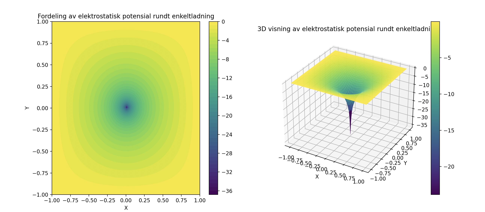

# Oblig: Numerisk løsning av en PDE

## Poisson-ligningen
Koden løser Poisson-ligningen, som er en viktig partiell differensialligning i fysikk, spesielt i elektrostatikk. Poisson-ligningen er gitt ved ∇^2 ϕ = −ρ/ϵ, hvor ϕ representerer det elektrostatiske potensialet og ρ er ladningstettheten. Området som er valgt her er et kvadratisk område i to romlige dimensjoner (x og y).

## Hvordan det er løst
Koden initialiserer en grid av størrelsen 100×100, som dekker et område fra -1 til 1 i både x- og y-aksene. En høy ladning plasseres i midten av griden, mens områder utenfor en gitt radius (0.5) settes til null for å konsentrere ladningen. Potensialet u beregnes iterativt ved hjelp av differanseformler som involverer verdier fra nærliggende celler, med mål om å oppnå konvergens når endringene mellom iterasjoner er under en fastsatt toleranse.

## Resultat
Etter 8782 iterasjoner oppnår koden konvergens, indikert ved at forskjellen mellom påfølgende løsninger er mindre enn 
1×10^(−4). Dette bekreftes ved utskriften "True etter 8782 iterasjoner". Visualiseringen av resultatene gjøres gjennom 2D- og 3D-plott, som viser hvordan det elektrostatiske potensialet fordeler seg rundt punktladningen, og gir en visuell representasjon av løsningens nøyaktighet og fordelingen av elektrostatisk potensial i området. Plottet kan sees her:

